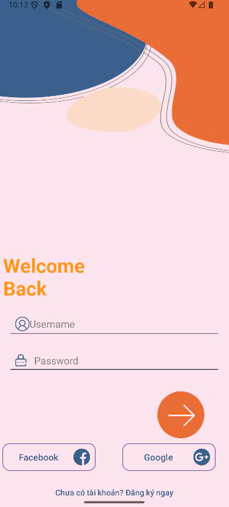
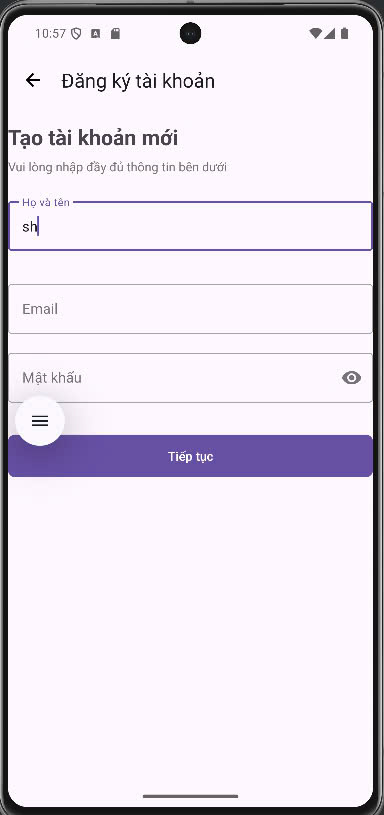
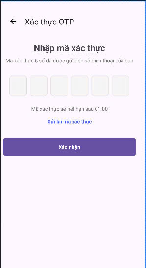
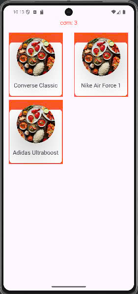
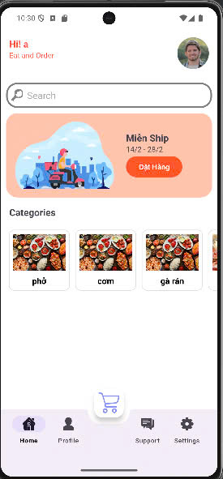

# KiemTraQuaTrinh

# Branch mới nhất là develop
# Hướng Dẫn Cấu Hình

## 1. Giao diện 

### 1.1 Intro


### 1.2 Login



### 1.3 Register



### 1.4 Xác thực OTP




### 1.4 Products page



### 1.5 Main



## 2. Cấu Hình Database
Mở MySQL và thực hiện các lệnh sau để tạo tài khoản, database và cấp quyền:

```sql
CREATE DATABASE KTGK;
CREATE USER 'ktgk_user'@'localhost' IDENTIFIED BY 'KtGK@123';
GRANT ALL PRIVILEGES ON KTGK.* TO 'ktgk_user'@'localhost';
```

## 3. Cấu Hình Network/Retrofit
- Nếu chạy API trên chính máy của bạn, đổi IP thành `localhost`.
- Nếu chạy API trên một máy khác, đổi IP thành địa chỉ của máy đó.

## 4. Cấu Hình Backend
Mở file `application.properties` và cấu hình như sau:
- Thêm dòng sau để kết nối với database đã tạo ở trên:
  ```yaml
    spring.datasource.url=jdbc:mysql://localhost:3306/KTGK
    spring.datasource.username=ktgk_user
    spring.datasource.password=KtGK@123
  ```
- Điều chỉnh port

  ```yaml
  server.port=8081
  ```

## 5. Thành Viên & Phân Công Công Việc

| MSSV | Họ và Tên | Công việc |
|------|-----------|-----------|
| 22110385 | Lê Huỳnh Như Nguyệt | Câu 1 |
| 22110388 | Tạ Nghĩa Nhân | Câu 2 |
| 22110338 | Nguyễn Văn Hùng | Câu 3 |
| 22110380 | Trần Trọng Nghĩa | Câu 4 |
| 22110317 | Võ Phú Hào | Câu 5 |
| 22110308 | Trần Tiến Đạt | Câu 6 |
| 22110287 | Hồ Vũ Thanh Bình | Câu 7 API product by category|
| 22110357 | Phạm Đăng Khôi | Câu 7 API All Category|
| 22110330 | Phạm Ngọc Hòa | Câu 7 API cho Register, Login |